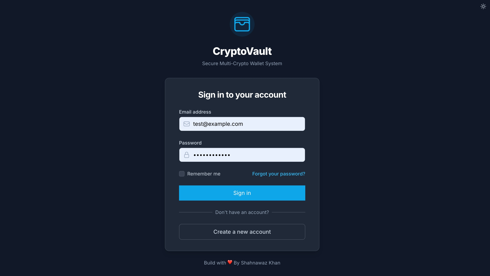
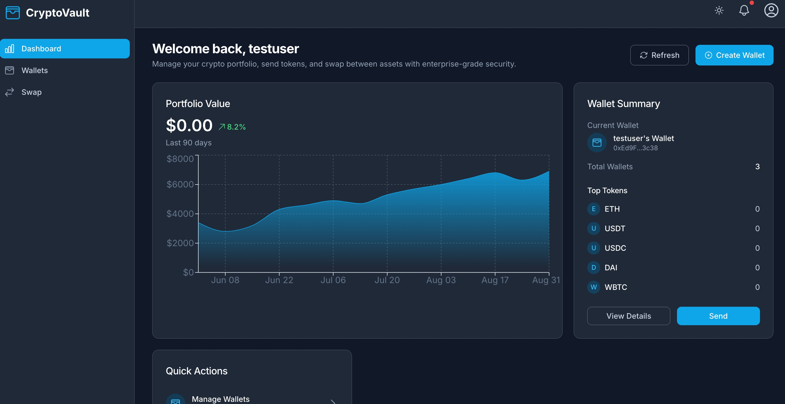
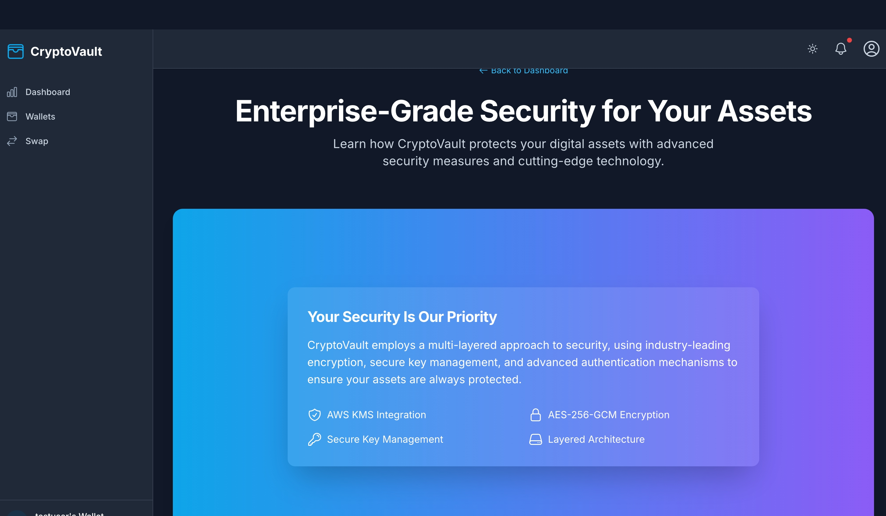
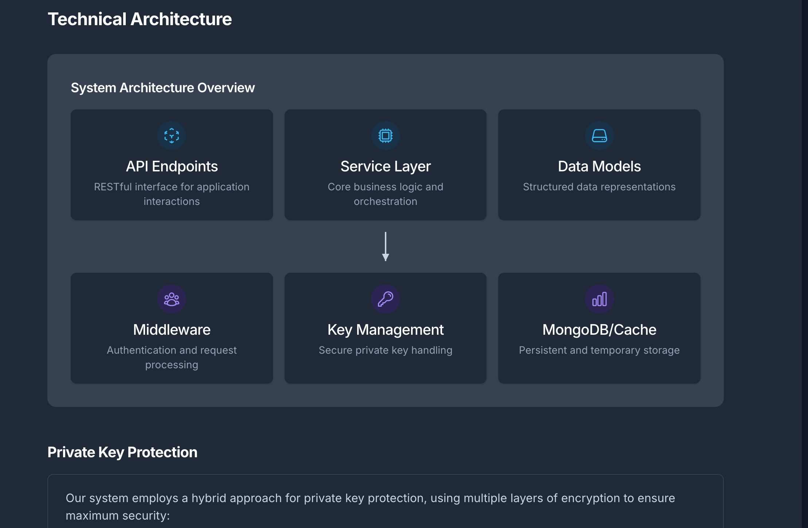
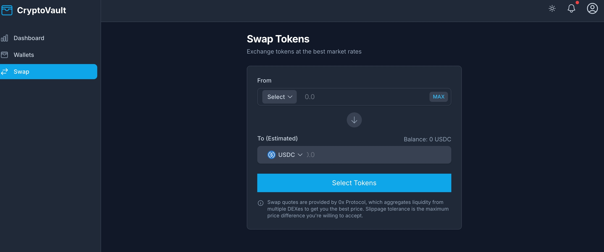

# CryptoVault - Secure Multi-Crypto Wallet System

CryptoVault is a secure, feature-rich custodial wallet system that allows users to generate and manage Ethereum wallets, supports multiple cryptocurrencies, enables token swapping, and securely stores private keys on the backend.







## Features

- 🔒 **Secure Authentication**: User registration and login with JWT-based authentication and refresh token rotation
- 💰 **Wallet Management**: Generate and manage multiple Ethereum wallets with intuitive UI
- 💵 **Multi-Token Support**: View balances of ETH and various ERC-20 tokens
- 💱 **Token Swapping**: Swap between different tokens using 0x Protocol with price comparison
- 💸 **Token Transfers**: Send tokens to other Ethereum addresses with dynamic gas estimation
- 🔐 **Secure Storage**: Private keys stored securely on the backend with AES-256-GCM encryption
- 🌓 **Dark/Light Mode**: Full theme support with smooth transitions
- 📱 **Responsive Design**: Mobile-friendly interface for on-the-go management

## Security Features

- **Zero Client-Side Private Keys**: All private keys are generated, encrypted, and stored exclusively on the backend
- **Hybrid Encryption**: Uses AWS KMS when available, with AES-256-GCM as fallback
- **JWT with Refresh Rotation**: Tokens use JTI tracking and rotation to prevent reuse
- **Rate Limiting**: Prevents brute force attacks
- **Memory Management**: Private keys are cached for minimal time periods and cleared when not needed

## Tech Stack

### Frontend
- **React** with TypeScript and Vite for fast development
- **React Router** for navigation
- **Tailwind CSS** for styling with responsive design
- **HeadlessUI** for accessible components
- **Recharts** for data visualization
- **Ethers.js** for Ethereum interactions
- **Context API** for state management

### Backend
- **Node.js** with Express and TypeScript
- **MongoDB** with Mongoose for data modeling
- **JWT** for authentication with refresh token mechanism
- **Ethers.js** for wallet operations and transactions
- **0x API** for token swapping and price discovery
- **AWS KMS** (optional) for enhanced key security

## Getting Started

### Prerequisites

- Node.js (v16 or later)
- MongoDB (local or Atlas)
- Infura API key (for Ethereum node access)
- 0x API key (for swap functionality)

### Installation

1. **Clone the repository**

```bash
git clone https://github.com/Shahnawazkhan83/crypto-vault.git
```

2. **Backend Setup**

```bash
cd backend

# Install dependencies
npm install

# Create .env file
cp .env.example .env

# Edit .env file with your configuration
# Fill in MongoDB URI, JWT secrets, Infura API key, etc.

# Start the development server
npm run dev
```

3. **Frontend Setup**

```bash
cd frontend

# Install dependencies
npm install

# Start the development server
npm run dev

# For production
npm run build
```

## API Documentation

The backend provides a comprehensive RESTful API for all wallet operations:

- **Auth Endpoints**: `/api/auth/register`, `/api/auth/login`, `/api/auth/refresh-token`, `/api/auth/logout`
- **Wallet Endpoints**: `/api/wallet`, `/api/wallet/:address`, `/api/wallet/:address/balances`
- **Transaction Endpoints**: `/api/wallet/:address/send`, `/api/wallet/:address/estimate-gas`
- **Swap Endpoints**: `/api/swap/price`, `/api/swap/quote`, `/api/swap/execute`


## Contributing

Contributions are welcome! Please feel free to submit a Pull Request.

1. Fork the repository
2. Create your feature branch (`git checkout -b feature/amazing-feature`)
3. Commit your changes (`git commit -m 'Add some amazing feature'`)
4. Push to the branch (`git push origin feature/amazing-feature`)
5. Open a Pull Request

## License

This project is licensed under the MIT License - see the LICENSE file for details.

## Acknowledgments

- [0x Protocol](https://0x.org/) for DEX aggregation
- [Ethers.js](https://docs.ethers.io/) for Ethereum interactions
- [Tailwind CSS](https://tailwindcss.com/) for styling
- [HeadlessUI](https://headlessui.com/) for accessible components